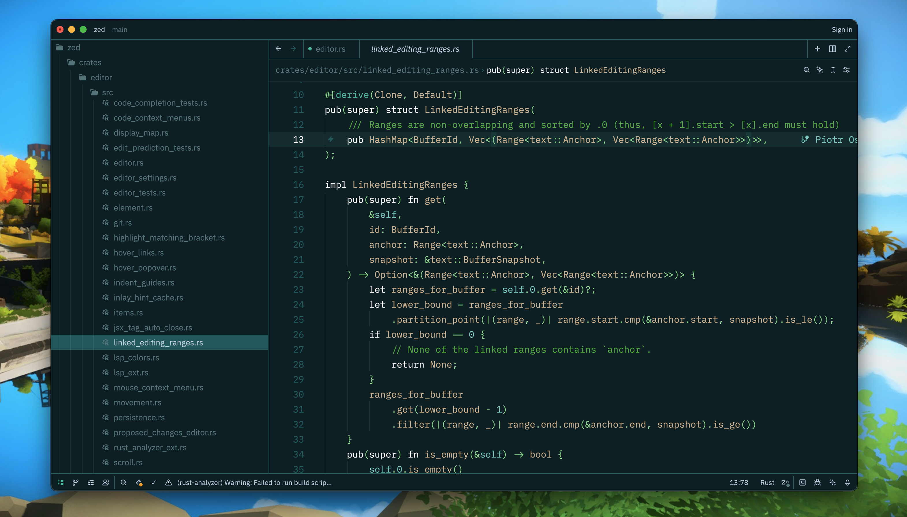

# Naysayer Theme for [Zed](https://zed.dev)

A color theme for Zed inspired by Jonathan Blow's compiler livestreams.
Based on [Nick Aversano's emacs theme](https://github.com/nickav/naysayer-theme.el).

## Screenshots

#### Install via Zed

This theme can be installed via the Zed extensions store.
After installing, the theme can be selected in the theme selector.

#### Install manually

1. Copy the `naysayer.json` file to `~/.config/zed/themes`.
2. Select the theme (`Settings` ➡️ `Select Theme` ➡️ `naysayer`).
